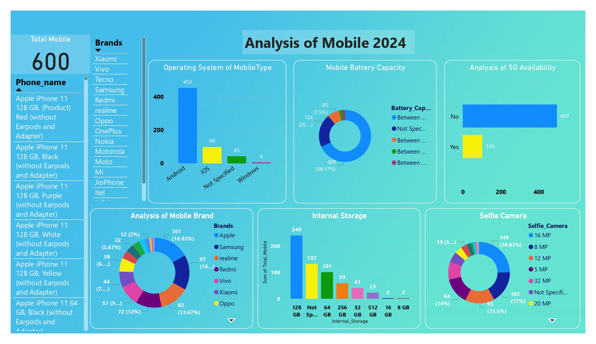

# Analysis of Mobile 2024

## Project Overview

This project aims to analyze mobile data using MySQL Workbench for database management and Power BI Desktop for data visualization. The objective is to derive meaningful insights from the mobile data through SQL queries and interactive dashboards.

## Contents

- `Dashboard.pdf`: PDF format of the Power BI dashboard showcasing various visualizations.
- `SQL_Queries.pdf`: PDF containing SQL queries used to solve specific questions related to the project.
- `Analysis_of_Mobile_2024.pbix`: Power BI Desktop file with the complete dashboard.
- `Analysis_of_Mobile.sql`: SQL file with the queries used in MySQL Workbench.

## Project Structure

### SQL Queries

The `Analysis_of_Mobile.sql` file contains SQL queries that perform various operations on the mobile data. The queries are designed to answer specific questions and extract insights, such as:

1. **Check Mobile Features and Price List:**
    ```sql
    SELECT phone_name, price FROM mobile_analysis;
    ```
2. **Find Out the Price of 5 Most Expensive Phones:**
    ```sql
    SELECT * FROM mobile_analysis ORDER BY price DESC LIMIT 5;
    ```
3. **Find Out the Price of 5 Cheapest Phones:**
    ```sql
    SELECT * FROM mobile_analysis ORDER BY price ASC LIMIT 5;
    ```
4. **List of Top 5 Samsung Phones with Price and All Features:**
    ```sql
    SELECT * FROM mobile_analysis WHERE brands = 'samsung' ORDER BY price DESC LIMIT 5;
    ```
5. **Top 5 High Price Android Phones:**
    ```sql
    SELECT * FROM mobile_analysis WHERE operating_system_type = 'android' ORDER BY price DESC LIMIT 5;
    ```
6. **Top 5 Lower Price Android Phones:**
    ```sql
    SELECT * FROM mobile_analysis WHERE operating_system_type = 'android' ORDER BY price ASC LIMIT 5;
    ```
7. **Top 5 Higher Price iOS Phones:**
    ```sql
    SELECT * FROM mobile_analysis WHERE operating_system_type = 'ios' ORDER BY price DESC LIMIT 5;
    ```
8. **Top 5 Lower Price iOS Phones:**
    ```sql
    SELECT * FROM mobile_analysis WHERE operating_system_type = 'ios' ORDER BY price ASC LIMIT 5;
    ```
9. **Top 5 Phones with 5G Support:**
    ```sql
    SELECT * FROM mobile_analysis WHERE 5g_availability = 'yes' ORDER BY price DESC LIMIT 5;
    ```
10. **Total Price of All Mobiles by Brand:**
    ```sql
    SELECT brands, SUM(price) FROM mobile_analysis GROUP BY brands;
    ```

The `SQL_Queries.pdf` document provides a detailed explanation of each query, including the question it addresses and the logic behind it.

### Power BI Dashboard

The Power BI dashboard, saved as `Analysis_of_Mobile_2024.pbix` and presented in `Dashboard.pdf`, includes the following components:

- **Operating System of Mobile Type:** Clustered column chart
- **Mobile Battery Capacity:** Donut chart
- **Analysis of 5G Availability:** Clustered bar chart
- **Analysis of Mobile Brand:** Donut chart
- **Internal Storage:** Clustered column chart
- **Selfie Camera:** Donut chart

Additionally, users can filter and explore data based on phone names and brands, such as:

#### Phone Names Examples
- Realme 9 Pro 5G 128 GB, 8 GB RAM, Sunrise Blue
- Redmi 10A 64 GB, 4 GB RAM, Sea Blue
- Samsung Galaxy A33 5G 128 GB, 8 GB RAM, Awesome Black
- OnePlus 10 Pro 256 GB, 12 GB RAM, Emerald Forest
- Vivo T1 5G 128 GB, 8 GB RAM, Rainbow Fantasy

#### Brands Examples
- Realme
- Redmi
- Samsung
- Vivo
- Motorola
- Infinix
- Oppo
- Nokia

The dashboard provides a comprehensive view of the mobile data, enabling users to understand and analyze the information effectively.

## Dashboard Snapshot



## How to Use

1. **SQL Queries**:
   - Open MySQL Workbench and load the `Analysis_of_Mobile.sql` file.
   - Execute the queries to generate results based on the mobile data.
   - Refer to `SQL_Queries.pdf` for a detailed explanation of each query.

2. **Power BI Dashboard**:
   - Open Power BI Desktop and load the `Analysis_of_Mobile_2024.pbix` file.
   - Explore the various visualizations and interact with the filters to analyze the data.
   - Refer to `Dashboard.pdf` for a static view of the dashboard and key insights.

## Conclusion

This project demonstrates the use of MySQL Workbench for data management and Power BI Desktop for data visualization in analyzing mobile data. The combination of SQL queries and interactive dashboards provides a powerful toolset for extracting and presenting insights from the data.

For any questions or further information, please feel free to contact me.
